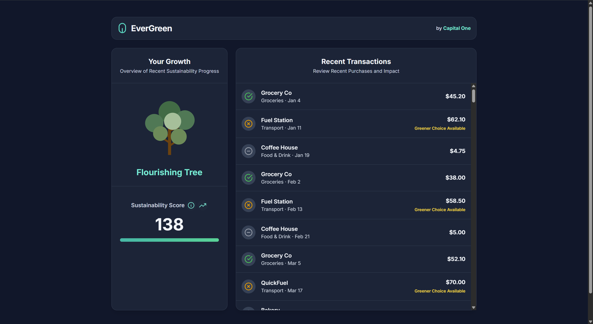

# EverGreen

## Description

A Sustainable Finance Tracker for Capital One.

## Features

- Calculates a "Sustainability Score" and features a growing "EverGreen" tree to visually represent your eco-friendly progress
- Categorizes each purchase to provide feedback and offer a personalized recommendation for an environmental alternative
- Created a UI using React and logic using JavaScript (Optimized for a future connection to a mobile Capital One application)

## Uses

- Financial Awareness
- Behavioral Change
